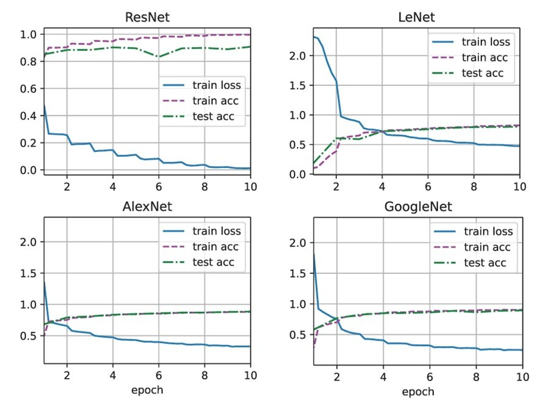
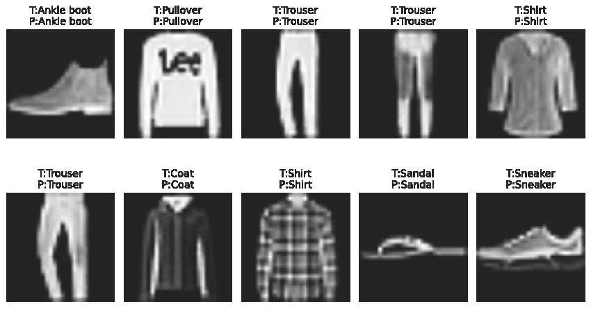

# CNN_classification_task
Convolutional Neural Network for Figure Classification in Pytorch
- # DataSet
- Fashion-MNIST contain `70k` figures, this dataset default set `60k` figures as training set, the rest `10k` as test set.

- Each figure is a 28 * 28 pixel object, we may reshape it size to 224 * 224 pixel.

- All `70k` figures belong to `10` classification, including T-shirt/top, Trouser, Pullover, Dress, Coat, Sandal, Shirt,Sneaker, Bag, Ankle boot.

- # CNN model performance
|   Model   | train loss | train accuracy | test accuracy |
| :-------: | :--------: | :------------: | :-----------: |
|   LeNet   | 0.474    | 0.822  | 0.799 |
|  AlexNet  | 0.329  | 0.880  | 0.885 |
| GoogleNet | 0.250    | 0.904   | 0.895 |
|  ResNet   | 0.013    | 0.997   | 0.908 |

- # Prediction Visualization of ResNet
